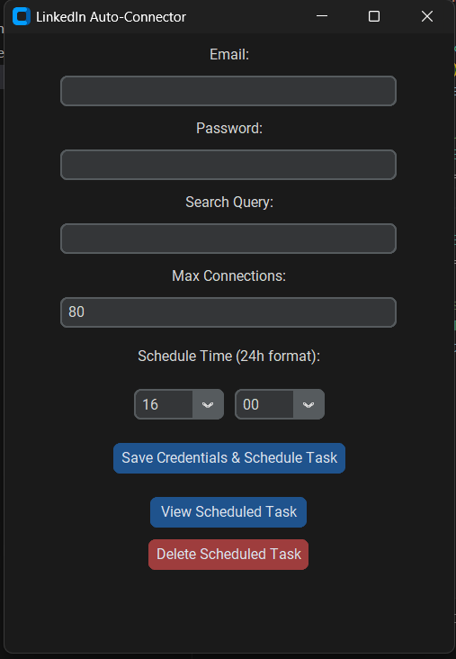

# 📎 LinkedIn Connection Automation Bot

<p align="center">
  
</p>


A lightweight **Python + Selenium** tool that automates sending connection requests on LinkedIn based on a specific search query.  
You can customize your LinkedIn credentials, search query, and the number of connections you'd like to send.

---

## 📑 Features

- Log into your LinkedIn account.
- Search for people by a query.
- Automatically click **Connect** buttons.
- Respect maximum connection limit.
- Detect weekly invitation limits and stop safely.

---

## 📦 Requirements

- **Python 3.9+**
- **Google Chrome** browser installed
- **ChromeDriver** matching your Chrome version (download from [here](https://sites.google.com/chromium.org/driver/))

---

## 📥 Installation & Setup

### 📌 Step 1: Install Python

Download and install Python if you haven't already:  
👉 [https://www.python.org/downloads/](https://www.python.org/downloads/)

---

### 📌 Step 2: Download the Project Files

Either download this repository as a ZIP and extract it, or clone it using:

```bash
git clone https://github.com/Rand-Power-State/LinkedIn-Connect-Tool.git
```

Navigate to the project folder:

```bash
cd linkedin-connection-bot
```

---

### 📌 Step 3: Install Required Python Packages

Create a virtual environment (optional but recommended):

```bash
python -m venv .venv
```

Activate the virtual environment:

- **Windows:**

```bash
./venv/Scripts/activate
```

- **Mac/Linux:**

```bash
source .venv/bin/activate
```

Then install dependencies:

```bash
pip install -r requirements.txt
```

---

### 📌 Step 4: Download and Set Up ChromeDriver

- Find your current Google Chrome version:  
  Go to `chrome://settings/help`  

- Download the matching **ChromeDriver** from:  
  👉 [https://sites.google.com/chromium.org/driver/](https://sites.google.com/chromium.org/driver/)

- Place the downloaded `chromedriver.exe` in the same folder as `main.py`

---

### 📌 Step 5: Set Up Your Credentials

Create a file named `credentials.json` in the project directory with this structure:

```json
{
  "email": "your_email@example.com",
  "password": "your_password",
  "search_query": "Software Developer",
  "max_connections": "10"
}
```

---

## 🚀 How to Run the Bot

### 📌 Run via Python

In your terminal or PowerShell (inside the project folder):

```bash
python main.py
```

---

## 🛑 Common Error Fixes

**Error:**

```
_tkinter.TclError: bitmap "icon.ico" not defined
```

**Fix:**  
Either delete or comment out the line in your code that sets the icon:

```python
# self.iconbitmap("icon.ico")
```

Or make sure you have a valid `icon.ico` file in your project folder.

---

## ⚠️ Disclaimer

This tool is developed for **educational and personal use only**.  

Automating actions on LinkedIn may violate their terms of service.  
**Use at your own risk. The developer holds no responsibility for any account restrictions, bans, or other consequences resulting from the use of this tool.**

---

## 📬 Author

**Rand Power State**  
[LinkedIn](https://www.linkedin.com/company/rand-power-state-pty-ltd/)

---

## ✅ License

This project is released under the [MIT License](LICENSE).
